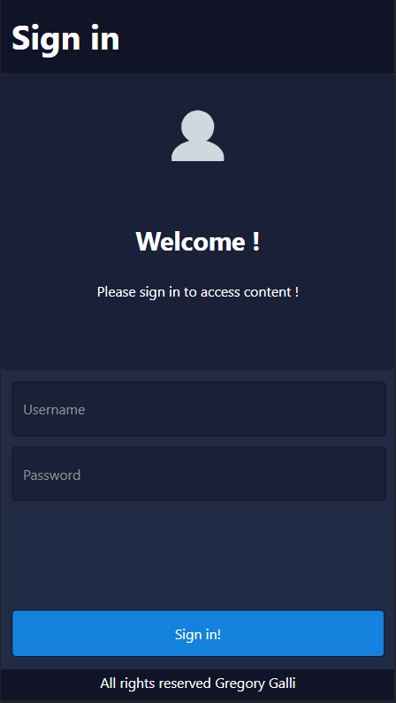
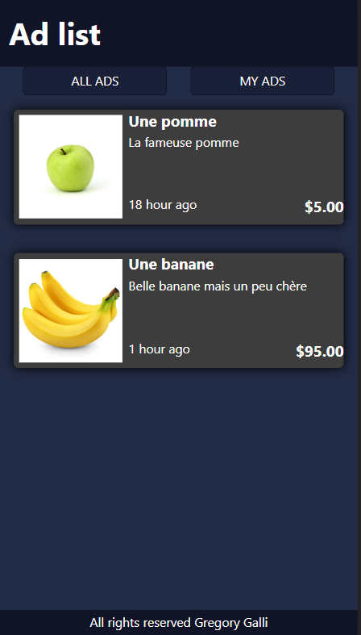

# FrameworkTD1

## Installation et prérequis

Aucun

## Structure du projet

2 pages html sont disponibles dans le répertoire /src/html  
Ces deux pages reposent sur 3 fichiers CSS
- /src/css/styles.css  

-> Fichier de style commun aux deux pages
- /src/css/login.css  

-> Fichier de style particulier pour login.html
- /src/css/annonces.css  

-> Fichier de style particulier pour annonces.html

## Responsive

Les deux pages html ont une strucutre globale commune en grid layout:
- header
- main-content
- footer
  
Le main-content est un grid layout different pour chacun des fichiers: 

login page:
- welcome modal
- login input (Username / Password)
- Submit button

annonces page:
- navigation
- listes des annonces

Les flex layout ont été utilisés pour la liste des annonces responsive (avec les medias queries) et pour placer correctement certain élément comme les boutons de navigation et le prix/date de publication des annonces.

## Screenshot

Login page: 

Annonces page: 

PS: J'ai volontairement ajouté mon propre theme, j'espere que je ne suis pas de mauvais gout ;) 

